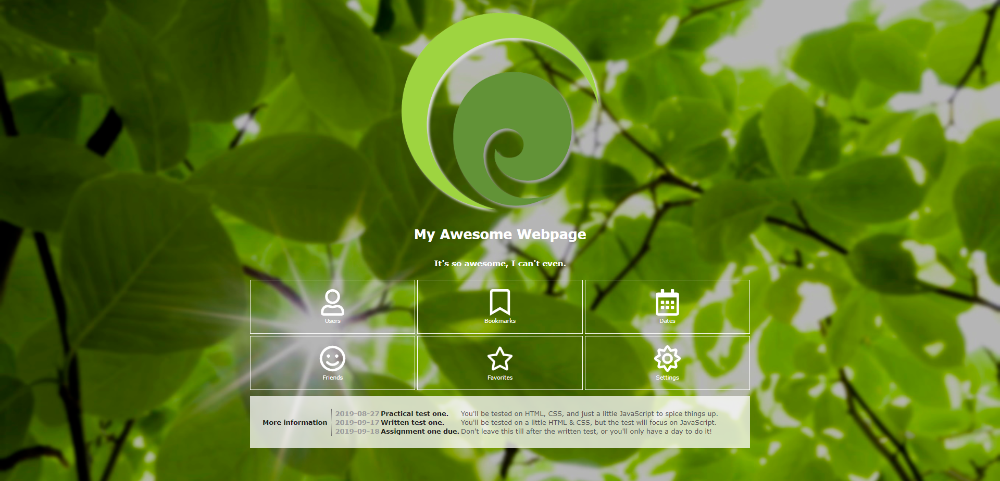
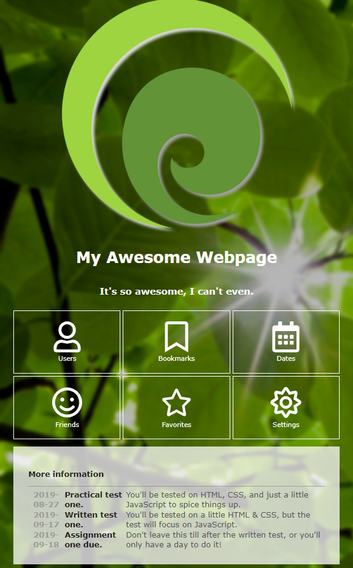
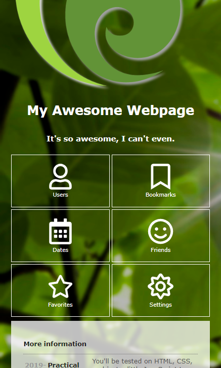

# Session Two - CSS Grid, Flex & Media Queries
In this session you'll learn CSS layouts using modern techniques such as `grid` and `flex`. You'll also learn about responsive design and how this can be achieved via media queries.


## Online resources
The following websites may be useful resources for you when completing these exercises:
- [Flexbox](https://developer.mozilla.org/en-US/docs/Learn/CSS/CSS_layout/Flexbox)
- [CSS grid](https://developer.mozilla.org/en-US/docs/Web/CSS/CSS_Grid_Layout)
- [Responsive design](https://developer.mozilla.org/en-US/docs/Learn/CSS/CSS_layout/Responsive_Design)

## Exercise 01 - A fancy front page

In this exercise, we will add the necessary CSS to a webpage such that it looks as per the below screenshot. **You may not edit the HTML for this exercise - only the CSS**.



### a) Site layout

First, let's complete the base website design. Examine the contents of the `01-koru-page` folder, then make modifications to `site.css`.

You may choose to follow the specification below, or you may experiment yourself.

#### Specification

- All elements within the body should have the Verdana font. If that font is not available, the Geneva font should be used. If neither are available, then sans-serif font should be used. The text's color should be `#FEFEFE`.

- The `body` should have a background image set to `bigleaves.jpg` (located in the assets folder). The background image should be set to `no-repeat`, and should be set to `cover` mode.

- The `body` should have padding of `20px` on the top, right, and left sides.

- The `.container` div should have a width of `1200px`. It should be horizontally centered within the body.

- All headings should have `bold` font.

- The `.header` div should lay out its child components using *flexbox*. It should align them in a column, and horizontally center its children.

- The image inside the header should be its usual size by default, but should never be larger than 90 per cent of the viewport width.

- The `.buttongrid` div and its children should be styled as follows:

   - The `.buttongrid` div should have top and bottom margins of `10px`. It should lay out its child components using *CSS grid*, with three columns of equal width. Grid row height should be `auto`. The *gap* between rows and columns should be `5px`.

   - The `button`s inside the button grid should have a `transparent` background color, and a `1px` solid white border. They should have a padding of `20px` on the top and bottom, and `5px` on the left and right.

   - When the user hovers over those buttons, the background color should change to `rgba(255, 255, 255, 0.5)`.

   - The buttons should lay out their child components using *flexbox*. Child components should be laid out in a `column`, and should be centered vertically and horizontally.

   - All ``s inside the button grid should be `64px` square.

   - All children of the buttons inside the button grid should have `2px` margins on the top and bottom.

- The `.panel` div and its children should be styled as follows:

   - The `.panel` div should have a background color of `rgba(255, 255, 255, 0.75)`, and padding of `30px` on all sides. It should lay out its children using *flexbox*. Children should be laid out in a `row`, and be `stretch`ed vertically.

   - All *descendents* of the panel should have their text color set to `#231F20`.

   - The `.panellabel` div should have a `1px` dotted border on the right, with a color of `#706F6F`. It should also have a `5px` right margin, and `10px` right padding. It should center its child `<p>` vertically and horizontally.

   - The `.infotable`'s `<th>`s should have a text color of `rgb(155, 155, 155)`.

   - The `.infotable`'s `<td>`s should have a text color of `rgb(83, 83, 83)`.

**Hint 1:** To apply a style to *all items* on a page, you can use the following CSS selector:
```css
* {
    /* Your styles go here. */
}
```

**Hint 2:** To apply a style to *all children* of some elements, you can use `*` in conjunction with another selector. For example, the following CSS will apply a style to all children of a button:
```css
button > * {
    /* Your styles go here. */
}
```

### b) Responsive design

Now, we will make the website responsive using media queries.

On screens smaller than `1200px`, the `.container`'s `width` should be changed to `100%`.

On screens smaller than `800px`, the page should look similar to this screenshot:



Specifically, the following changes should be made:

- The `.panel` div should change its flex direction to `column`. It should justify its children to the start, and stretch its children horizontally.

- The `.panellabel` should remove its right border, margin, and padding. Those should be replaced with a `5px` bottom margin, and a `1px` dotted `#706F6F` bottom border.

On screens smaller than `600px`, the page should look similar to this screenshot:



Specifically, the `.buttongrid` div should now only contain two columns, rather than three.


## Exercise 02 - The world's your oyster

For any remaining time in the workshop (or in your own time!), experiment! Perhaps you'd like to come up with your own design for a webpage and want to dive right in? Maybe you'd like more practice, and could consider making small modifications to the existing exercises to play around? Or, perhaps you'd like to further explore the wealth of online resources available to you.

We hope you've enjoyed this crash course in HTML / CSS, and will continue to become more immersed in the wide world of web design in the future!
